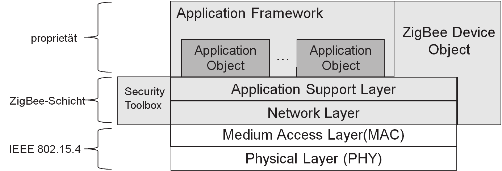
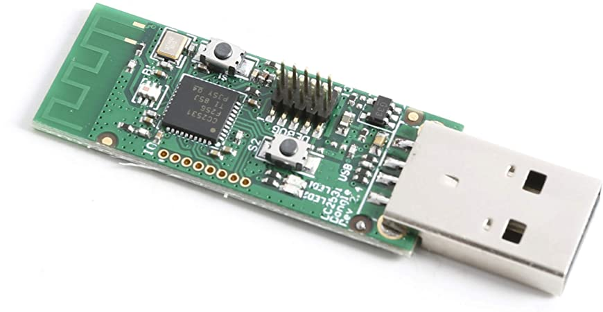
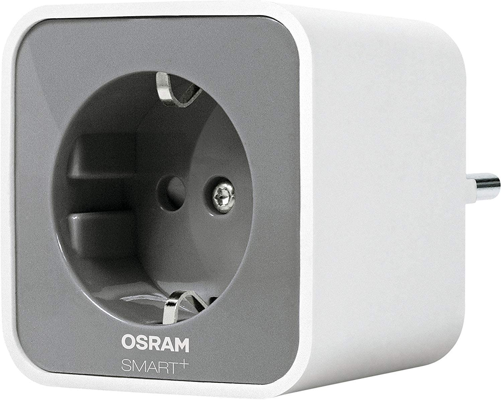
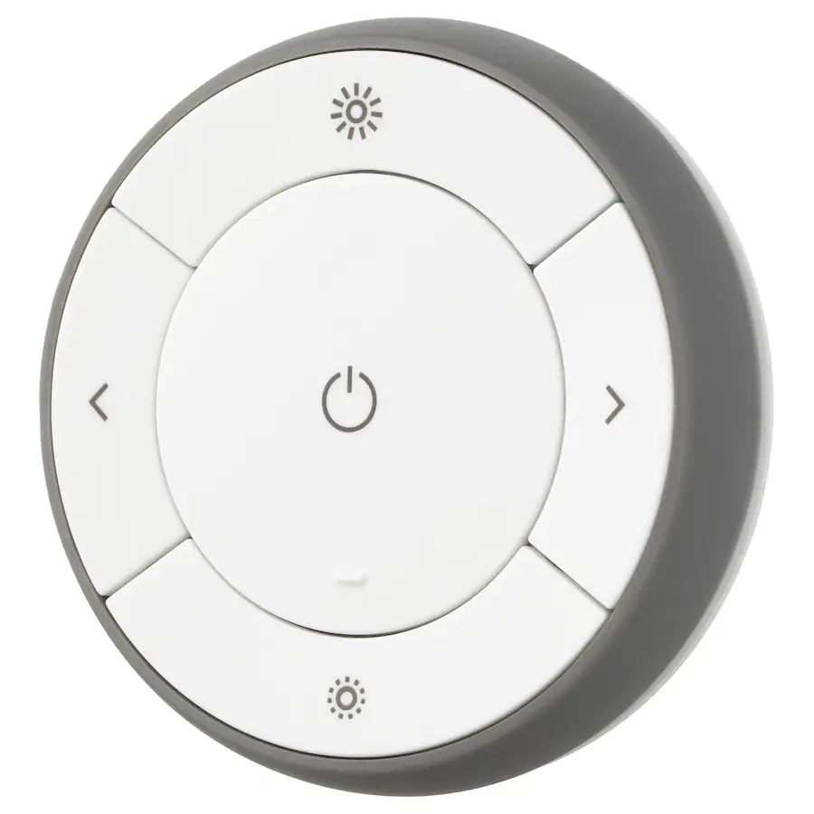
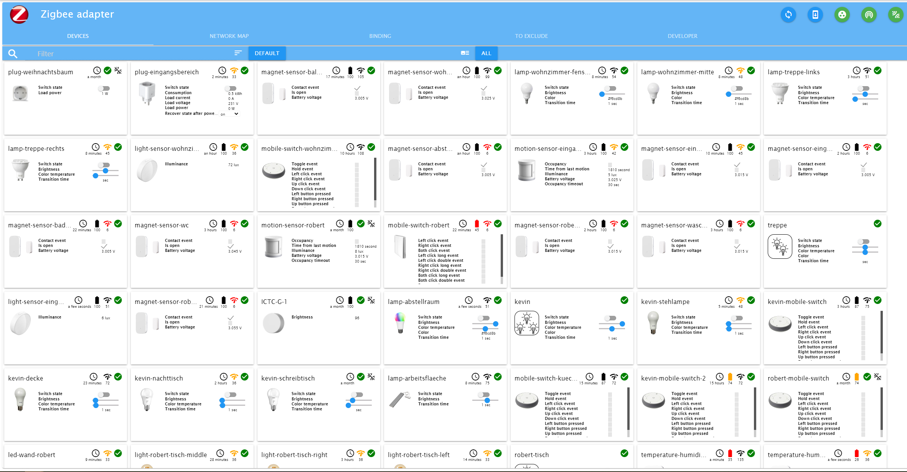
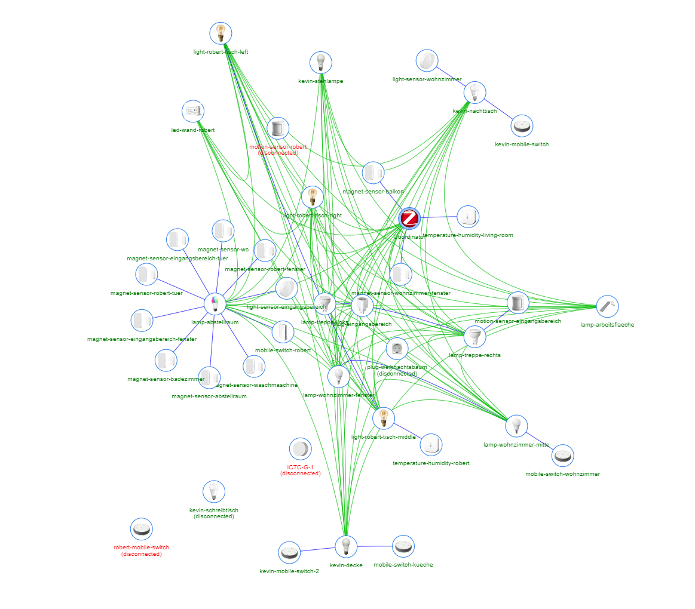

# Überblick

- Nach `IEEE 802.15.4` standartisierte Funktechnologie
- Für Netzwerke mit mittlerer Reichweite und geringen Übertragungsraten
- Fokus liegt auf Energieeffizienz

# Einsatzgebiete

- Sensornetzwerke
  - Güterüberwachung
  - Gebäudeüberwachung

. . .

- Gebäudeautomatisierung
  - IKEA Tradfri
  - Philips Hue
  - etc.

# Fakten

|                  |                            |
| ---------------- | -------------------------- |
| Standard         | IEEE 802.15.4              |
| Frequenz         | 2400 MHz, 868 MHz (Europa) |
| Reichweite       | 10--75 m                   |
| Übertragungsrate | max. 250 kb/s              |
| Topologie        | Stern, Baum, Mesh          |
| Stromverbrauch   | sehr gering                |

# Aufbau

# Gerätetypen

## Koordinator

- Organisiert das Netzwerk
  - Routing-Tabellen
  - Teilnehmer-Listen
- Nur einer pro Netzwerk

. . .

→ Single Point of Failure

## Beispiel: Koordinator

## Full Function Device

- Kann Senden und Empfangen
- Agiert zusätzlich als Router
- Dient der Erweiterung des Netzwerks
- Können zusätzlich Steuerungsaufgaben übernehmen

## Beispiel: Full Function Device

## Reduced Function Device

- Kann Senden und Empfangen
- Kann keine Nachrichten weiterleiten

## Beispiel: Reduced Function Device

# Netzwerktypen

## Beacon-Netzwerk

- Regelmäßige "Beacons" (Heartbeat) Nachrichten vom Koordinator
- Zur Synchronisation des Netzwerks
- Um einen Überblick über die Devices im Netzwerk zu erhalten

## Non-Beacon-Netzwerk

- Keine regelmäßigen "Beacons"
- Ressourcensparender
- Geräte verbinden sich mit dem Netzwerk, wenn sie tatsächlich etwas senden müssen

# Beispiel: ZigBee Home Automation Netzwerk

##

##

